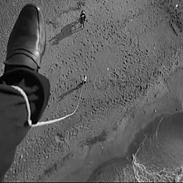

<AudioPlayer source={'http://traffic.libsyn.com/reverberationradio/Reverberation_16.mp3'} />

<strong>Reverberation #16 <a href="http://itunes.apple.com/us/podcast/reverberation-radio/id520739212?ign-mpt=uo%3D4" title="subscribe" target="_blank">subscribe</a> </strong>1. Glenn Branca - Lesson No. 1 for Electric Guitar 2. Jim Ford - Point of No Return 3. Bill Fox - Over And Away She Goes 4. The Lovin&rsquo; Spoonful - Butchie&rsquo;s Tune 5. Tim Rose - Morning Dew 6. Lee Hazlewood - Your Thunder &amp; Your Lightning 7. Moby Grape - It&rsquo;s A Beautiful Day Today 8. The Cryan&rsquo; Shames - The Sailing Ship 9. The Beach Boys - Be With Me

