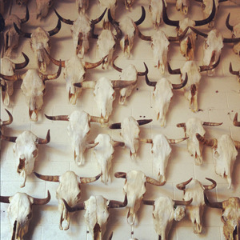

<AudioPlayer source={'http://traffic.libsyn.com/reverberationradio/Reverberation_18.mp3'} />

<strong>Reverberation #18</strong>&nbsp; <strong><a href="http://itunes.apple.com/us/podcast/reverberation-radio/id520739212?ign-mpt=uo%3D4" title="subscribe" target="_blank">subscribe</a></strong> 1. Jorge Ben - Comanche 2. Father John Misty - I'm Writing A Novel &nbsp;&nbsp;&nbsp; 3. Ty Segall &amp; White Fence - Easy Ryder &nbsp;&nbsp;&nbsp; 4. Los 007 - No Te Puedo Encontrar &nbsp;&nbsp;&nbsp; 5. J.J. Cale - Tijuana &nbsp;&nbsp;&nbsp; 6. Big Star - The India Song &nbsp;&nbsp;&nbsp; 7. Further - J.O. Eleven  8. Davy Jones &amp; the Lower Third - I Dig Everything  9. Ric Menck - The Bicycle Song &nbsp;&nbsp;&nbsp; 10. Jackson C. Frank - Can't Get Away From My Love 11. The Stone Roses - Tightrope &nbsp;  

