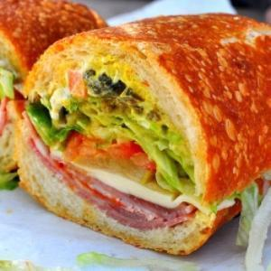

<AudioPlayer source={'https://traffic.libsyn.com/reverberationradio/Reverberation_20.mp3'} />

<strong>Reverberation #20 <a href="http://itunes.apple.com/us/podcast/reverberation-radio/id520739212?ign-mpt=uo%3D4" title="subscribe" target="_blank">subscribe</a> </strong>1. Hackamore Brick - Oh Those Sweet Bananas  2. The Golliwogs - Fragile Child 3. Rodriguez - Hate Street Dialogue  4. The Fentones - Until the Dawn 5. Eddie Callahan - Santa Cruz Mountains 6. Dr. John - Did She Mention My Name 7. Jackie DeShannon &amp; The Byrds - Splendor in the Grass 8. Heron - Yellow Roses 9. &nbsp;The Idle Race - Morning Sunshine 10. Abner Jay - St. James Infirmary Blues

