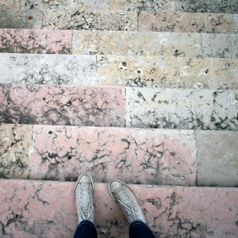

<AudioPlayer source={'http://traffic.libsyn.com/reverberationradio/Reverberation_21.mp3'} />

<strong>Reverberation #21 <a href="http://itunes.apple.com/us/podcast/reverberation-radio/id520739212?ign-mpt=uo%3D4" title="subscribe" target="_blank">subscribe</a> </strong>1. Shoes - Do I Get So Shy  2. Brian Sands - Hawaiian Spongecake Holiday  3. Ronnie Bird - Sad Soul  4. Pink Fairies - War Girl 5. Able Tasmans - Sour Queen  6. Penguin Cafe Orchestra - Telephone And Rubber Band  7. Apple - The Other Side  8. Serge Bulot - Pipoune's Dance 9. The Rokes - Piangi Con Me  10. Arthur Russell - Goodbye Old Paint

