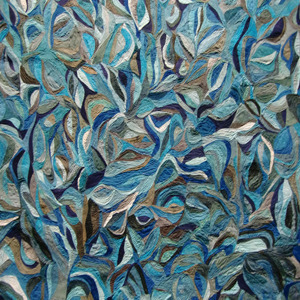

<AudioPlayer source={'https://traffic.libsyn.com/reverberationradio/Reverberation_22.mp3'} />

<strong>Reverberation #22</strong> <strong><a href="http://itunes.apple.com/us/podcast/reverberation-radio/id520739212?ign-mpt=uo%3D4" title="subscribe" target="_blank">subscribe</a></strong> 1. The Mynah Birds - Go On and Cry 2. Alvin Robinson/The Rolling Stones - Down Home Girl 3. Los Destellos - Onsta La Yerbita 4. Lijadu Sisters - Come On Home 5. Inter-Groupie Psychotherapeutic Elastic Band - Floating 6. The Troggs - Listen To The Man 7. Allah-Las - No Voodoo (Daytrotter/Studio Paradiso Session) 8. Vietnam - Gibby Haines 9. John Maus - Hey Moon 10. Esther Phillips - I Can&rsquo;t Help It (I&rsquo;m Still In Love With You) 11. Sam McLoughlin and Alison Cooper - Snowfall 12. Bob Lind - Cool Summer

