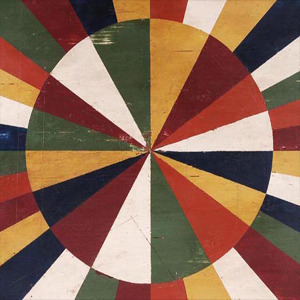

<AudioPlayer source={'https://traffic.libsyn.com/reverberationradio/Reverberation_24.mp3'} />

<strong>Reverberation #24 <a href="http://itunes.apple.com/us/podcast/reverberation-radio/id520739212?ign-mpt=uo%3D4" title="subscribe" target="_blank">subscribe</a> </strong>1. Luiz Bonf&aacute; - Jacarand&aacute;  2. Brinsley Schwarz - Hymn To Me 3. Grateful Dead - Early Morning Rain 4. Heron - Madman 5. The Sandals - Winter Spell 6. The Flying Burrito Brothers - Older Guys 7. Link Wray - Fire and Brimstone 8. Can - Tango Whiskyman 9. Booker T. &amp; the M.G.s - L.A. Jazz Song 10. Arthur Lee - Everybody's Gotta Live

