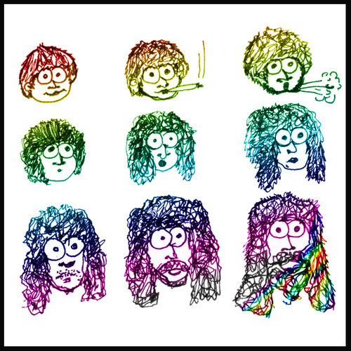

<AudioPlayer source={'http://traffic.libsyn.com/reverberationradio/Reverberation_26.mp3'} />

<strong>Reverberation #26 <a href="http://itunes.apple.com/us/podcast/reverberation-radio/id520739212?ign-mpt=uo%3D4" title="subscribe" target="_blank">subscribe</a> </strong>1. The Deviants - The Junior Narco Rangers (If We Gotta Get Raleigh from Chicago, We're Gonna) 2. Jigsaw - Tumblin' 3. Beach Fossils - Desert Sand 4. Count Five - Revelation in Slow Motion 5. Gene Clark - No Other 6. Spacemen 3 - Call the Doctor 7. Black Sabbath - Planet Caravan 8. After Glow - Dream Away 9. TOPS - Rings of Saturn 10. Public Image Ltd. - Radio 4

