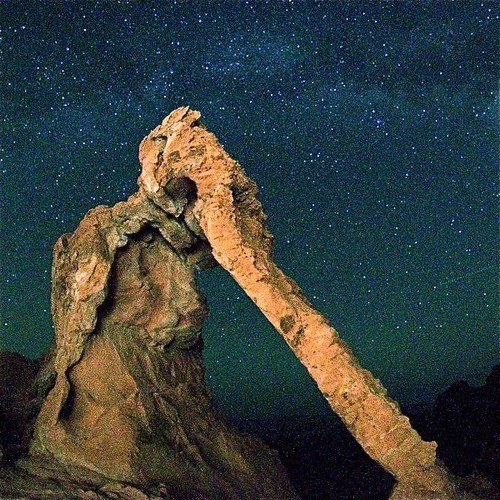

<AudioPlayer source={'http://traffic.libsyn.com/reverberationradio/Reverberation_28.mp3'} />

<strong>Reverberation #28 <strong><a href="http://itunes.apple.com/us/podcast/reverberation-radio/id520739212?ign-mpt=uo%3D4" title="subscribe" target="_blank">subscribe</a></strong> </strong>1. Barry Goldberg - Life&rsquo;s Fantasy 2. Rodriguez - Cause 3. Gary Farr - Don&rsquo;t Know Why You Bother Child 4. Jim Ford - I&rsquo;m Ahead If I Can Quit While I&rsquo;m Behind 5. Palace Music - New Partner 6. Wreckless Erik - Joe Meek 7. Wymond Miles - Pale Moon 8. Blaze Foley - Clay Pigeons 9. Lee Hazlewood - Son Of A Gun

