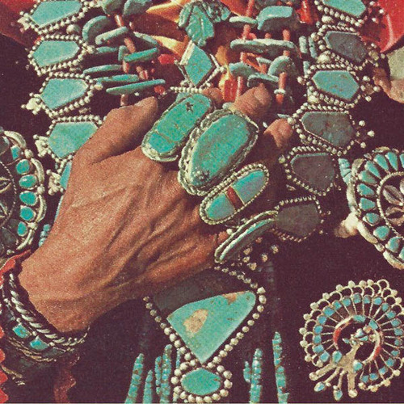

<AudioPlayer source={'https://traffic.libsyn.com/reverberationradio/Reverberation_30.mp3'} />

<strong>Reverberation #30 <strong><a href="http://itunes.apple.com/us/podcast/reverberation-radio/id520739212?ign-mpt=uo%3D4">subscribe</a></strong> </strong>1. Ronny &amp; The Daytonas - Sandy 2. The New Dawn - Last Morning 3. Trap Door II - &pound;&trade; 4. The Beach Boys - All I Wanna Do  5. The Range Of Light Wilderness - Under Your Spell 6. Euphoria - Through A Window  7. Mark Eric - Where Do The Girls OF The Summer Go? 8. Fred Neil - December's Dream 9. John's Children - Love I Thought I'd Found  10. Jan &amp; Dean - Like A Summer Rain 11. Gabor Szabo - Three King Fishers  12. Brian Jonestown Massacre - Whatever Hippie Bitch

