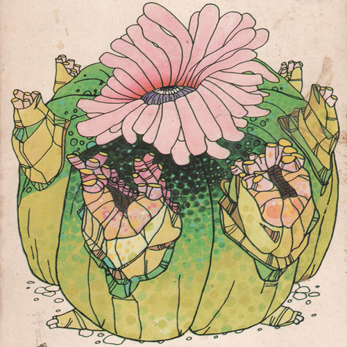

<AudioPlayer source={'http://traffic.libsyn.com/reverberationradio/Reverberation_34.mp3'} />

<strong>Reverberation #34 </strong><strong><a href="https://itunes.apple.com/us/podcast/reverberation-radio/id520739212?ign-mpt=uo%3D4" title="subscribe" target="_blank">subscribe</a></strong><strong> </strong>1. Terry Telson - When Evening Comes 2. John J. Francis - Sometimes (In The Night) 3. Vernon Wray - Prison Song 4. Freddie Scott - I&rsquo;ll Be Leaving Her Tomorrow 5. Bobby Charles - I Must Be In A Good Place Now 6. The Brazda Brothers - Lonely Time 7. Ronnie Lane - The Poacher 8. Bruce Springsteen - Racing In The Street

