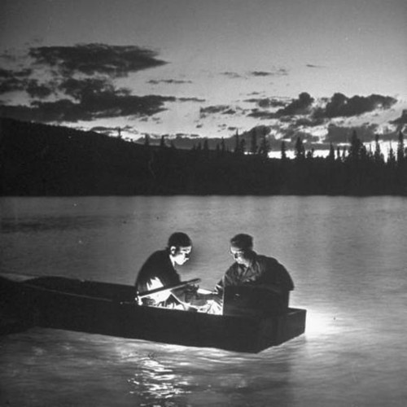

<AudioPlayer source={'http://traffic.libsyn.com/reverberationradio/Reverberation_35.mp3'} />

<strong>Reverberation #35 </strong><strong><a href="https://itunes.apple.com/us/podcast/reverberation-radio/id520739212?ign-mpt=uo%3D4" title="subscribe" target="_blank">subscribe</a> </strong>1. Gandalf - Me About You 2. Karen Dalton - Something On Your Mind 3. John Phillips - Drum 4. Bobb Trimble - One Mile From Heaven (Short Version) 5. Tame Impala - Apocalypse Dreams 6. Onuma Singsiri - Mae Kha Som Tam 7. Witch - Lazy Bones 8. The Painted Ship - Frustration 9. Tonetta - Drugs Drugs Drugs

