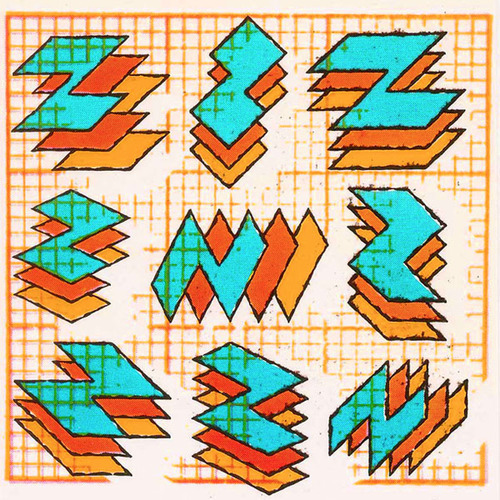

<AudioPlayer source={'https://traffic.libsyn.com/reverberationradio/Reverberation39.mp3'} />

<strong>Reverberation #39 </strong><strong><strong><strong><a href="https://itunes.apple.com/us/podcast/reverberation-radio/id520739212?ign-mpt=uo%3D4" title="subscribe" target="_blank">subscribe </a></strong></strong></strong>1. The Mirrors - Beaver Girls 2. Tsegu&eacute;-Maryam Gu&eacute;brou - Tenkou! Why Feel Sorry? 3. Kyle Tomzo - Please Come Home 4. The Kinks - There Is No Life Without Love 5. Electric Indian - Keem-O-Sabe 6. Crabby Appleton - Go Back 7. Hank Ballard &amp; the Midnighters - Never Knew 8. G&eacute;rard Manset - Animal, On Est Mal 9. Mayo Thompson - Horses 10. Van Morrison - Ring Worm 11. Kool Teen! - Track 13

