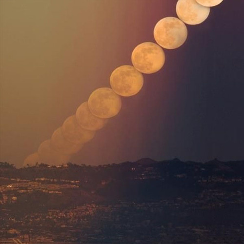

<AudioPlayer source={'http://traffic.libsyn.com/reverberationradio/Reverberation40.mp3'} />

<strong>Reverberation #40 <strong><strong><strong><a href="https://itunes.apple.com/us/podcast/reverberation-radio/id520739212?ign-mpt=uo%3D4" title="subscribe" target="_blank">subscribe</a></strong></strong></strong> </strong>1. The Beach-Niks - Last Night I Cried 2. The Jades - Till I Die 3. The Sound Offs - The Angry Desert 4. Wilbert Harrison - Happy in Love 5. Joe Gaston and the Crew - Without You 6. The Byrds - Draft Morning 7. Buddy Long - It's Nothin' to Me 8. The Desert Rats - Sohonie 9. Tim Maia - Ela Partiu 10. Johnny Williams - Another Love

