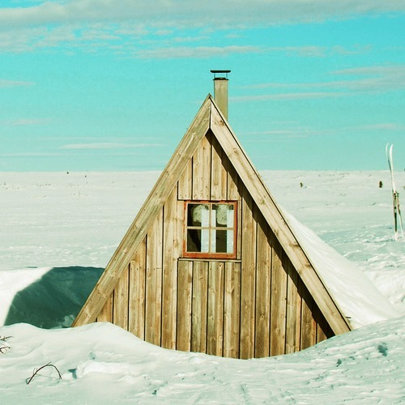

<AudioPlayer source={'https://s3.amazonaws.com/ReverberationRadio/Reverberation%E2%9D%84%E2%98%83.mp3'} />

<strong>Reverberation</strong> &#10052;&#9731; <strong><strong><strong><strong><a href="https://itunes.apple.com/us/podcast/reverberation-radio/id520739212?ign-mpt=uo%3D4" title="subscribe" target="_blank">subscribe</a></strong></strong></strong></strong> 1. Galaxies - Christmas Eve  2. The Soul Survivors - Snow Man  3. The Ventures - Snowflake  4. Brook Benton - You're All I Want For Christmas 5. The Wailers - She's Coming Home 6. Jimmy Charles - Santa Won't Be Blue For Christmas  7. The Sonics - Santa Claus 8. The Avalanches - Sleigh Ride  9. Margo Guryan - I Don't Intend To Spend Christmas Without You 10. The Wailers - Maybe This Year  11. The Gris Gris - Winter Weather  12. Vashti Bunyan - Coldest Night Of The Year  13. Black On White Affair - Auld Lang Syne  14. The Magic Carpet - Alan's Christmas Card

