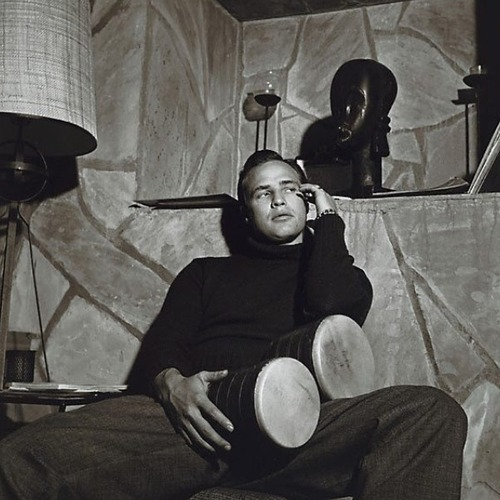

<AudioPlayer source={'http://traffic.libsyn.com/reverberationradio/Reverberation44.mp3'} />

<strong>Reverberation #44</strong> <strong><a href="https://itunes.apple.com/us/podcast/reverberation-radio/id520739212?ign-mpt=uo%3D4" title="subscribe" target="_blank">subscribe</a></strong> 1. Joe Bataan - Subway Joe 2. Nick Waterhouse - Sleepin' Pills (demo) 3. The Pretty Things - It'll Never Be Me 4. Tame Impala - Feels Like We Only Go Backwards 5. Jacco Gardner - Summer's Game 6. Gap Dream - Generator  7. The Growlers - People Don't Change Blues  8. Mose Allison - The Seventh Son 9. Raul Seixas - Metamorfose Ambulante  10. The Golliwogs - Brown Eyed Girl

