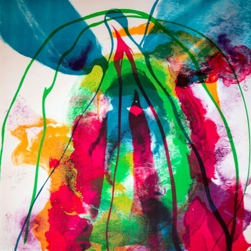

<AudioPlayer source={'https://traffic.libsyn.com/reverberationradio/Reverberation47.mp3'} />

<strong>Reverberation #47 <strong><strong><strong><a href="https://itunes.apple.com/us/podcast/reverberation-radio/id520739212?ign-mpt=uo%3D4" title="subscribe" target="_blank">subscribe</a></strong></strong></strong> </strong>1. Link Wray - Girl From The North Country 2. Keith Hudson - Trust &amp; Believe 3. Mor Thiam - Ayo Ayo Nene 4. The Baroques - Mary Jane 5. Tommy Jay - I Was There 6. Milpatte - Spontz 7. K&#1080;&#1085;&#1086; - Hey You, You Better Keep Walking! 8. Snapper - Dead Pictures 9. Tall Dwarfs - Farewell 10. Arthur Russell - Keeping Up

