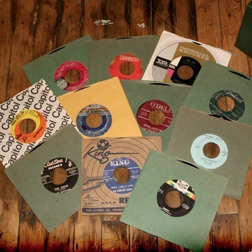

<AudioPlayer source={'http://traffic.libsyn.com/reverberationradio/Reverberation48.mp3'} />

<strong>Reverberation #48 <strong><strong><strong><strong><a href="https://itunes.apple.com/us/podcast/reverberation-radio/id520739212?ign-mpt=uo%3D4" title="subscribe" target="_blank">subscribe</a></strong></strong></strong></strong></strong> 1. The Soul Four - Misery 2. Jimmy McCracklin - The Drag 3. Freddie King - The Bossa Nova Watusi Twist 4. The Fabulous Denos - Once I Had A Love 5. Gary U.S. Bonds - I Want to Hollar 6. The Beatles - I'm Happy Just To Dance With You 7. The Spinners - Sweet Thing 8. Otis Leavill - When The Music Grooves 9. Georgie Fame - Yeh Yeh 10. The Stratfords - Never Leave Me 11. Marie Kaigler - I Am The Oppressed (read by Jim Reese - Detroit, MI)<strong> </strong>

