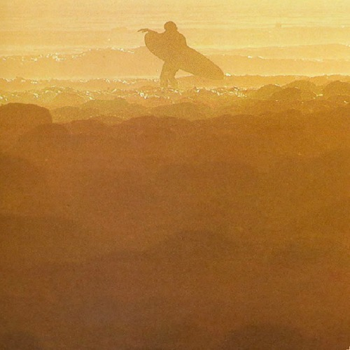

<AudioPlayer source={'http://traffic.libsyn.com/reverberationradio/Reverberation50.mp3'} />

<strong>Reverberation #50 <strong><strong><strong><strong><strong><strong><a href="https://itunes.apple.com/us/podcast/reverberation-radio/id520739212?ign-mpt=uo%3D4" title="subscribe" target="_blank">subscribe</a></strong></strong></strong></strong></strong></strong></strong> 1. Lynn Castle with Last Friday&rsquo;s Fire - Rose Colored Corner 2. The Blue Things - Since You Broke My Heart 3. The Alarm Clocks - Yeah! 4. The Index - Israeli Blue 5. The Rainy Daze - In My Mind Lives a Forest 6. Syndicate of Sound - You 7. Captain Beefheart and His Magic Band - Call On Me (demo) 8. The Left Banke - Dark is the Bark 9. Shagrat - Beautiful Deceiver 10. The American Revolution - Show Me How To Cry 11. The Hollies - So Lonely 12. The West Coast Pop Art Experimental Band - Here&rsquo;s Where You Belong

