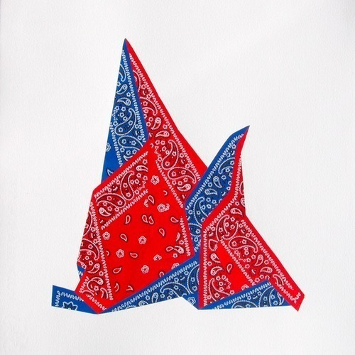

<AudioPlayer source={'https://traffic.libsyn.com/reverberationradio/Reverberation52.mp3'} />

<strong>Reverberation #52 <strong><strong><strong><strong><strong><strong><strong><a href="https://itunes.apple.com/us/podcast/reverberation-radio/id520739212?ign-mpt=uo%3D4" title="subscribe" target="_blank">subscribe</a></strong></strong></strong></strong></strong></strong></strong></strong> 1. The Limi&ntilde;anas - Crystal Anis 2. Tashaki Miyaki - Hollywood Forever Cemetery Sings (FJM cover) 3. Tomorrows Tulips - Wednesday 4. Blank Tapes - Home Away From Home 5. Sean Nicholas Savage - You Changed Me 6. Wet Illustrated - Luxury Waives 7. Foxygen - No Destruction 8. Jacco Gardner - Puppets Dangling 9. Vietnam - Stucco Roofs 10. Dirty Beaches - I&rsquo;m A King Bee (Slim Harpo cover)

