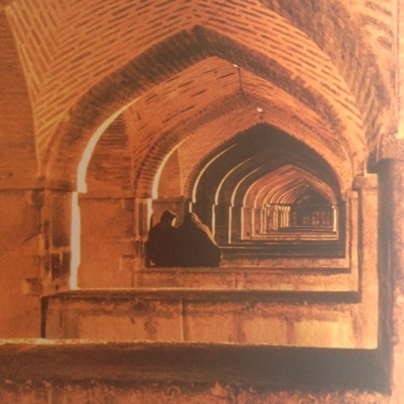

<AudioPlayer source={'https://traffic.libsyn.com/reverberationradio/Reverberation56.mp3'} />

<strong>Reverberation #56</strong> <strong><a href="https://itunes.apple.com/us/podcast/reverberation-radio/id520739212?ign-mpt=uo%253D4" target="_blank">subscribe</a></strong> 1. The Freeborne - Hurtin&rsquo; Kind of Woman 2. The Moon - I Should Be Dreaming 3. Pretty Things - What&rsquo;s the Use 4. Marcos Valle - Vinte e Seis Anos de Vida Normal 5. The Zodiac - Aquarius 6. Ravi Shankar and George Harrison - Raga (Garage Tapes) 7. Gautam Dasgupta - Duniya Mane Bura To Goli Maro 8. Smokestack Lightnin&rsquo; - Look What You&rsquo;ve Done 9. West Coast Pop Art Experimental Band - I Won&rsquo;t Hurt You 10. Dawn Penn - No, No, No

