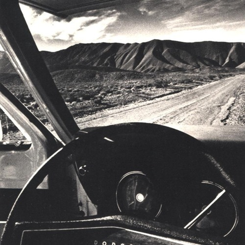

<AudioPlayer source={'https://traffic.libsyn.com/reverberationradio/Reverberation57.mp3'} />

<strong>Reverberation #57</strong> <strong><a href="https://itunes.apple.com/us/podcast/reverberation-radio/id520739212?ign-mpt=uo%3D4" title="subscribe" target="_blank">subscribe</a></strong> 1. Jorge Ben - Menina Mulher da Pele Preta 2. Rikki Illionga - Sheebeen Queen 3. The Troggs - Purple Shades 4. The Animals - A Girl Named Sandoz 5. The Afro Soul-Tet - Chocolate Drop 6. Blacklites - BL Movement 7. Anubis - Anubis 8. Ty Segall - Lovely One 9. Sir Douglas Quintet - I Don't Want To Go Home

