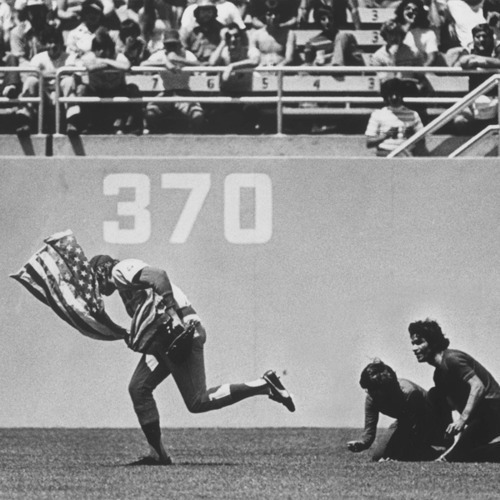

<AudioPlayer source={'http://traffic.libsyn.com/reverberationradio/Reverberation58.mp3'} />

<strong>Reverberation #58 </strong><strong><a href="https://itunes.apple.com/us/podcast/reverberation-radio/id520739212?ign-mpt=uo%3D4" title="subscribe" target="_blank">subscribe</a></strong> 1. Keith - Mr. Hyde 2. Meic Stevens - Dim Ond Heddiw Ddoe Ae Fory 3. Edgar Summertyme - I Would Do Anything 4. William C. Beeley - You Ain&rsquo;t Goin&rsquo; Nowhere 5. Ted Lucas - I&rsquo;ll Find A Way To Carry It All 6. Woo - The Western 7. Sonny Bono - Laugh At Me 8. The Beau Brummels - You Tell Me Why 9. Nick Garrie - The Nightmare Of J.B. Stanislas 10. Jimmy Campbell - In My Room

