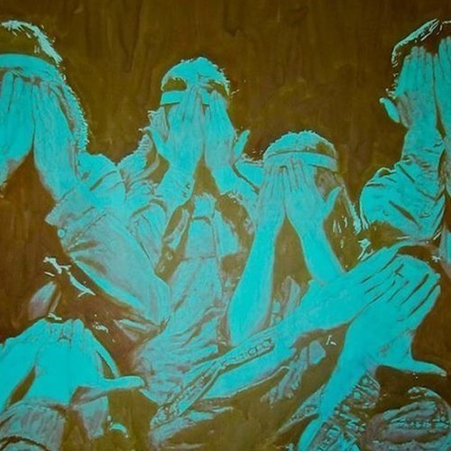

<AudioPlayer source={'https://traffic.libsyn.com/reverberationradio/Reverberation60.mp3'} />

<strong>Reverberation #60 </strong><strong><a href="https://itunes.apple.com/us/podcast/reverberation-radio/id520739212?ign-mpt=uo%3D4" title="subscribe" target="_blank">subscribe</a></strong> 1. Don Gere - Werewolves On Wheels 2. The Kinks - All Night Stand 3. Michael De Vera - Red Bandana 4. PAINT - No Werewolf 5. Phil Cordell - Red Lady 6. The Ceyleib People - Tygstl 7. Haruomi Hosono - Rose &amp; Beast 8. Alan Hawkshaw - Lazy Evening Blues 9. John &amp; Beverley Martyn - Auntie Aviator

