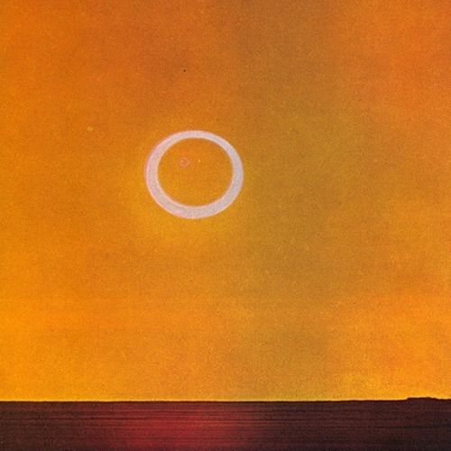

<AudioPlayer source={'http://traffic.libsyn.com/reverberationradio/Reverberation67.mp3'} />

<strong>Reverberation #67 </strong><strong><a href="https://itunes.apple.com/us/podcast/reverberation-radio/id520739212?ign-mpt=uo%3D4" title="subscribe" target="_blank">subscribe</a></strong><strong> </strong>1. Charles Wright &amp; The Malibus - Runky 2. Los Saicos - Come On 3. Kim Fowley - Surf Pigs 4. Victor Zanoni -&nbsp; 5. Gun Club - Mother Of Earth 6. Brinsley Schwarz - Ballad Of A Has-Been Beauty Queen 7. West Minist'r - Carnival 8. The Shelltones - Blue Castaway 9. The Fugitives - Wind Of Love 10. Jupiters' Children - This Is All I Ask

