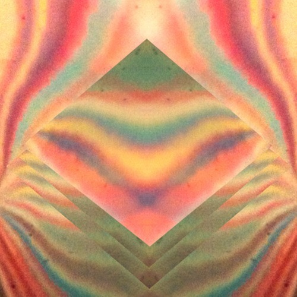

<AudioPlayer source={'https://traffic.libsyn.com/reverberationradio/Reverberation68.mp3'} />

<strong>Reverberation #68</strong> <strong><a href="https://traffic.libsyn.com/reverberationradio/Reverberation68.mp3" title="download" target="_blank">download</a>&nbsp;</strong> 1. Tashaki Miyaki - Somethin Is Better Than Nothin (alt. version) 2. Peaking Lights - Beautiful Son 3. Paul Messis - The Problem With Me 4. Floating Action - So Vapor 5. The Blank Tapes - Brazilia 6. Eden Ahbez - Full Moon 7. Panbers - Haai 8. Sir Victor Owaifo - Happy Day From Me To You 9. Longmont Potion Castle - Turtle Pleasure 10. Smash - We Come To Smash This Time 11. Pink Floyd - Country Rain

