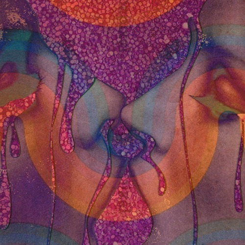

<AudioPlayer source={'http://traffic.libsyn.com/reverberationradio/Reverberation_69.mp3'} />

<strong>Reverberation #69 <a href="http://traffic.libsyn.com/reverberationradio/Reverberation_69.mp3" title="download" target="_blank">download</a>&nbsp; </strong>1. Le Seigneur Rochereau - Laisse-toi Aime 2. Wendell Austin and The Country Swings - LSD 3. Gortopia - Marley Purt Drive 4. The Cross Cuts - Lonely Beach 5. Joe Moks - Boys and Girls 6. Albert Collins - Thaw-Out 7. Reginald Garland - Chillin' Out 8. Tanya Tucker - New York City Song 9. Merkin Manor - Goodbye

