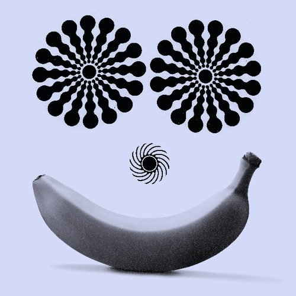

<AudioPlayer source={'https://traffic.libsyn.com/reverberationradio/Reverberation_80.mp3'} />

<strong>Reverberation #80 </strong><strong><a href="https://traffic.libsyn.com/reverberationradio/Reverberation_80.mp3" title="download" target="_blank">download</a> | <a href="http://snd.sc/1b4Mhgc" title="soundcloud" target="_blank">soundcloud</a> | <a href="http://i.mixcloud.com/CDmxMG" title="mixcloud">mixcloud</a> </strong>1. Buddy Holly - Love Is Strange (33 rpm) 2. Mickey Lee Lane - Hey Sah-Lo-Ney 3. Flamin' Groovies - Whiskey Woman 4. David Wiffen - White Lines 5. Young-Holt Unlimited - Oh Girl 6. Ariel Pink's Haunted Graffiti - Something Isn't Something 7. The City - I Wasn't Born To Follow 8. Duncan Browne - Journey 9. Kevin Vicvali - Old Richard 10. The Creation - If I Stay Too Long

