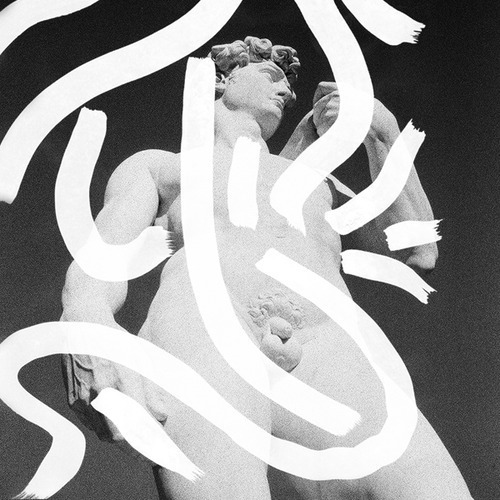

<AudioPlayer source={'https://traffic.libsyn.com/reverberationradio/Reverberation_81.mp3'} />

<strong>Reverberation #81 <a href="https://traffic.libsyn.com/reverberationradio/Reverberation_81.mp3" title="download">download</a></strong><strong> |&nbsp;<a href="http://i.mixcloud.com/CDudtw" title="mixcloud">mixcloud</a></strong> 1. The Nazz - Forget About It 2. Ultra Vivid Scene - She Screamed 3. John Berenzy Group - Vice Verses 4. Pink Fairies &nbsp;- The Snake 5. Grady Martin - The Fuzz 6. Nikki Sudden - New York 7. Harmonia - Monza 8. Hawkwind - You'd Better Believe It 9. Non Compos Mentis - Ultimate Orgasm

