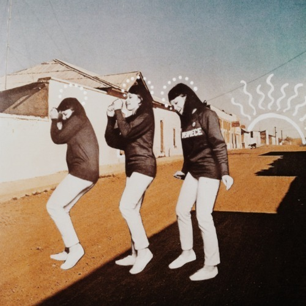

<AudioPlayer source={'https://traffic.libsyn.com/reverberationradio/Reverberation_96.mp3'} />

<strong>Reverberation #96 </strong><a href="https://traffic.libsyn.com/reverberationradio/Reverberation_96.mp3" title="download" target="_blank"><strong>download</strong> </a>1. Nick Waterhouse - Sleepin' Pills 2. Nicolas Nils &amp; Les Murators - Faudra Compter Avec Moi 3. Status Quo - Pictures of Matchstick Men 4. Angel D&aacute;mazo - Como Las Aguas Del Rio 5. Druids of Stonehenge - Speed 6. The Young Sinclairs - Problems 7. Suzanne - Shendah 8. Teta Lando - Muato Wa N&rsquo;Gingila 9. Marricks - Trains 10. Allah-Las - The Other Place

