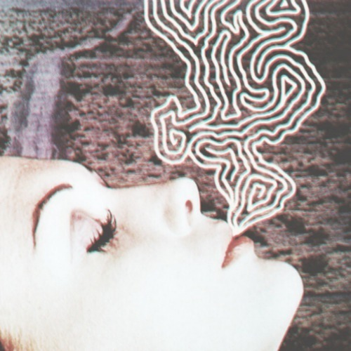

<AudioPlayer source={'https://traffic.libsyn.com/reverberationradio/Reverberation_97.mp3'} />

<strong>Reverberation #97 </strong><strong><a href="https://traffic.libsyn.com/reverberationradio/Reverberation_97.mp3" title="download" target="_blank">download </a></strong>1. Betrayers - Do You Smoke? 2. Luis Bacalov - La Pecora Nera (Grand Shake) 3. The Outsiders - Tomorrow 4. Johnny Cash - Wanted Man 5. The Pastel Six - Bandido 6. The Stairway To The Stars - Cry 7. Murals - Cereal 8. Roky Erickson - You Don&rsquo;t Love Me Yet 9. Tim Hardin - If I Were A Carpenter 10. Jonathan Wilson - Lovestrong

