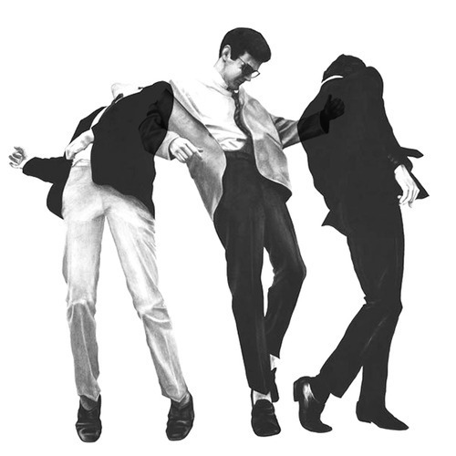

<AudioPlayer source={'http://traffic.libsyn.com/reverberationradio/Reverberation_98.mp3'} />

<strong>Reverberation #98 <a href="http://traffic.libsyn.com/reverberationradio/Reverberation_98.mp3" title="download" target="_blank">download </a></strong>1. Ebenezer Calendar &amp; His Maringar Band - Fire Fire Fire 2. Giorgio Moroder - Stop 3. The Go-Betweens - People Say 4. &#1050;&#1080;&#1085;&#1086; - &#1042;&#1080;&#1076;&#1077;&#1083;&#1080;&nbsp;&#1053;&#1086;&#1095;&#1100; 5. Hailu Mergia - Sewnetuwa 6. Buzzcocks - Love Is Lies 7. S.E. Rogie - Twist With The Morning Stars 8. Ros Sereysothea - Love Only You 9. Dwight Twilley - Little Stars 10. The Cairo Gang - Shivers

