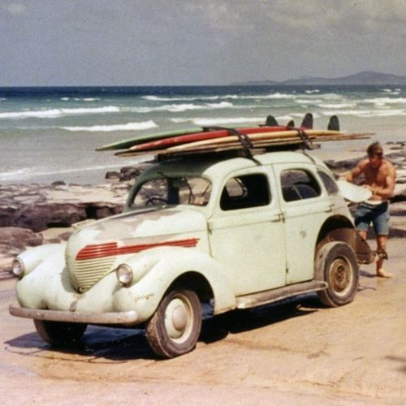

<AudioPlayer source={'http://traffic.libsyn.com/reverberationradio/Reverberation_99.mp3'} />

<strong>Reverberation #99</strong> <strong><a href="http://traffic.libsyn.com/reverberationradio/Reverberation_99.mp3" title="download" target="_blank">download</a></strong> 1. Kevin Ayers - Song For Insane Times 2. The Sandals - Porsche 3. Carole King - He's A Bad Boy 4.The Troggs - Butterflies and Bees 5. The Left Banke - Ivy, Ivy 6. Cal Tjader - East Of The Sun (And West Of The Moon) 7. Sonny Burgess - Restless 8. Faine Jade - Look At Me 9. Walpod Phetsuphan - Ding Ding Dong 10. The Riots - I Can Go On 11. The Honeybus - He Was Columbus 12. Primal Scream - Damaged

