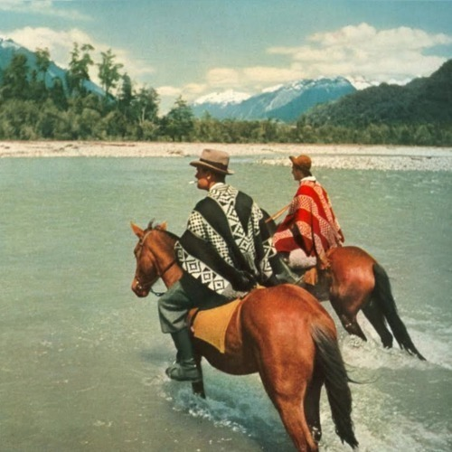

<AudioPlayer source={'http://traffic.libsyn.com/reverberationradio/Reverberation_100.mp3'} />

<strong>Reverberation #100 </strong><strong><a href="http://traffic.libsyn.com/reverberationradio/Reverberation_100.mp3" title="download" target="_blank">download</a> </strong>1. The New Dawn - New Dawn 2. Thee Midniters - Dreaming Casually 3. Los 007 - Te Amo Mi Nena 4. Foxygen - Bowling Trophies 5. The Animals - You're On My Mind 6. Bob Lind - Go Ask Your Man 7. Agincourt - When I Awoke 8. Gene Lawerence - Rio Mansanare' 9. John J. Francis - Simple Ben 10. Fleetwood Mac - Albatross

