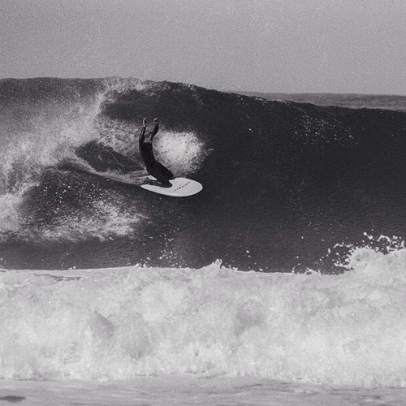

<AudioPlayer source={'http://traffic.libsyn.com/reverberationradio/Reverberation_101.mp3'} />

<strong>Reverberation #101 </strong><strong><a href="http://traffic.libsyn.com/reverberationradio/Reverberation_101.mp3" title="download" target="_blank">download </a></strong>1. The Glas Menagerie - Natasha 2. The Plagues - Tears From My Eyes 3. The Dovers - I Could Be Happy 4. Golden Dawn - Starvation 5. The Arondies - "69" 6. The Lovin' - Do It Again 7. Sonny &amp; The Sunsets - Too Young To Burn 8. Kevin Ayers - Lady Rachel 9. Mahmoud Ahmed - Atawurulign Lela

