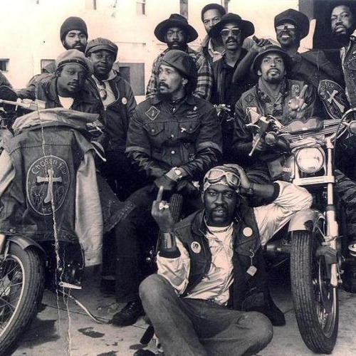

<AudioPlayer source={'https://traffic.libsyn.com/reverberationradio/Reverberation_102.mp3'} />

<strong>Reverberation #102 </strong><strong><a href="https://traffic.libsyn.com/reverberationradio/Reverberation_102.mp3" title="download" target="_blank">download </a></strong>1. Black Merda - Cynthy-Ruth 2. Johnnie Taylor - Jody's Got Your Girl And Gone 3. Regional Garland - Girl You Better Hurry 4. James Brown - The Boss 5. The Main Ingredient - Euphrates 6. Ernie &amp; the Top Notes - Things Could Be Better 7. Horace Andy - I've Got To Get Away 8. Eddie Simpson - Big Black Funky Slave 9. Wilson Pickett - Engine No. 9 10. Mel &amp; Tim - Starting All Over Again

