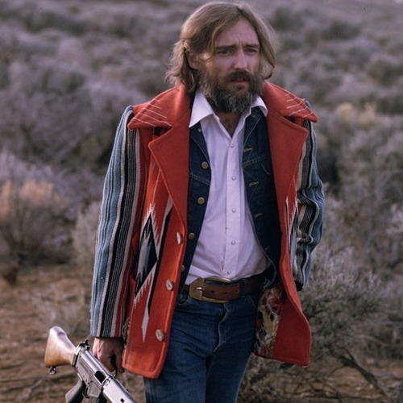

<AudioPlayer source={'https://traffic.libsyn.com/reverberationradio/Reverberation_103.mp3'} />

<strong>Reverberation #103 </strong><strong><a href="https://traffic.libsyn.com/reverberationradio/Reverberation_103.mp3" title="download" target="_blank">download </a></strong>1. Jean-Claude Vannier &ndash; Je M&rsquo;Apelle Geraldine 2. Mack Sigis Porter &ndash; Till The Fall 3. Karen Beth &ndash; Nothing Lasts 4. Smokey &amp; His Sister &ndash; Creators Of Rain 5. Carl Oglesby &ndash; Staring At The Sunshine 6. Plainsong &ndash; For The Second Time 7. John Manning &ndash; Hard Road To New Mexico 8. Jerry Jeff Walker &ndash; Desperados Waiting For The Train 9. Tool Shed &ndash; Angle In Her Walk 10. Eclection &ndash; St. George &amp; The Dragon (Up The Night)

