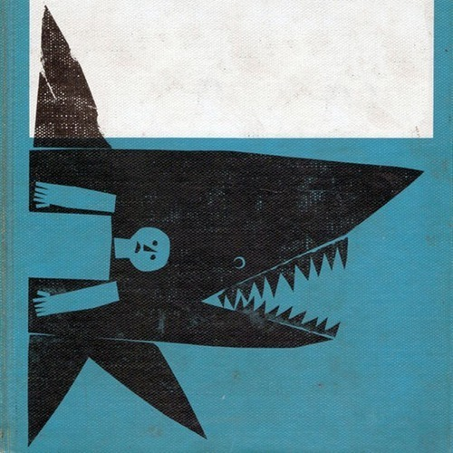

<AudioPlayer source={'http://traffic.libsyn.com/reverberationradio/Reverberation_104.mp3'} />

<strong>Reverberation #104 </strong><strong><a href="http://traffic.libsyn.com/reverberationradio/Reverberation_104.mp3" title="download" target="_blank">download </a></strong>1. The Glass Sun - Silence of the Morning 2. The Pink Fairies - Do It 3. Bob Welch (FM) - Angel 4. Daniel Mathieu - C'etait Un Beau Dimanche 5. Gary Farr - Don't Know Why You Bother Child 6. Alex Chilton - Hook or Crook 7. The Troggs - I Love You Baby 8. Haruomi Hosono - Hurricane Dorothy 9. Laghonia - Everybody on Monday 10. The Endd - This is Really the Zoo Plus Two 11. John Cale - You Know More Than I Know 12. Michael Hurley - Sweedeedee

