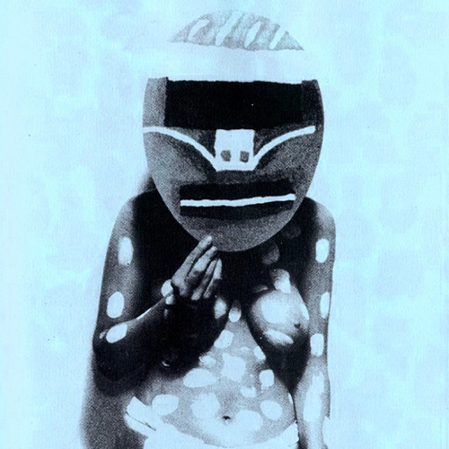

<AudioPlayer source={'https://traffic.libsyn.com/reverberationradio/Reverberation_106.mp3'} />

<b>Reverberation #106</b> <b><a href="https://traffic.libsyn.com/reverberationradio/Reverberation_106.mp3" title="download">download </a></b>1.&nbsp;Amelita Galli-Curci -&nbsp;Crepuscule 2. The Modern Art - Oriental Towers 3. The Art Museums - Rough Frame 4. Jim Shepard - Bingle Bangle 5. King Tubby - Dub On The Street Again 6. Eno - I'll Come Running (1974 Peel Session) 7. Moondog - Coffee Beans 8. NRBQ - When I Feel You Around me 9. Meat Puppets - Up On The Sun (Demo) 10. Powder - Turn Another Page

