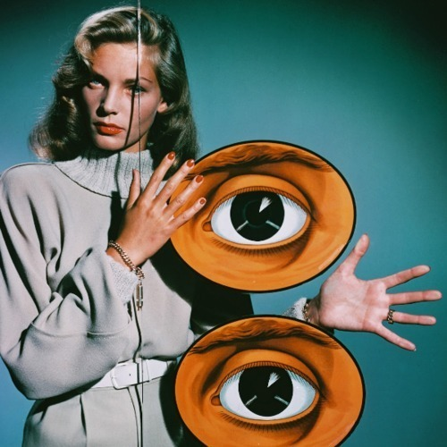

<AudioPlayer source={'https://traffic.libsyn.com/reverberationradio/Reverberation_107.mp3'} />

<strong>Reverberation #107 </strong><strong><a href="https://traffic.libsyn.com/reverberationradio/Reverberation_107.mp3" title="download" target="_blank">download </a></strong>1. Holly Maxwell - Only When You&rsquo;re Lonely 2. The Impressions - Minstrel And Queen 3. Barbara Lewis - Pushin&rsquo; A Good Thing Too Far 4. The Duprees - So Little Time 5. Justine &ldquo;Baby&rdquo; Washington - It&rsquo;ll Never Be Over For Me 6. The Isley Brothers - Write To Me 7. Jackie Shane - Any Other Way 8. Kenni Woods - Can He Take A Hint 9. The Drew Vels - Tell Him 10. Roddie Joy - Come Back Baby 11. The Sapphires - Who Do You Love 12. Marv Johnson - Don&rsquo;t Leave Me 13. The Miracles - If Your Mother Only Knew

