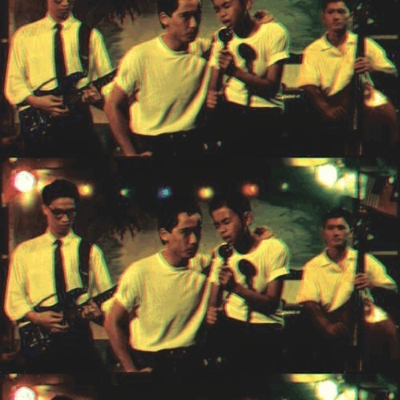

<AudioPlayer source={'https://traffic.libsyn.com/reverberationradio/Reverberation_108.mp3'} />

<strong>Reverberation #108</strong> <strong><a href="https://traffic.libsyn.com/reverberationradio/Reverberation_108.mp3" title="download" target="_blank">download</a></strong> 1. Rachel Sweet - It&rsquo;s So Different Here 2. Ishikawa Akira - The Dawning of Love 3. The Steam Machine - Let the Feeling Begin 4. PP Arnold - The First Cut Is the Deepest 5. The Revolving Paint Dream - Sun, Sea, Sand 6. Laurene LaVallis - Key To Our Love 7. Malo - Suavecito 8. Yo Yo&rsquo;s - Leaning On You 9. Small Factory - Happy To See 10. Gary Shearston - Faded Streets, Windy Weather

