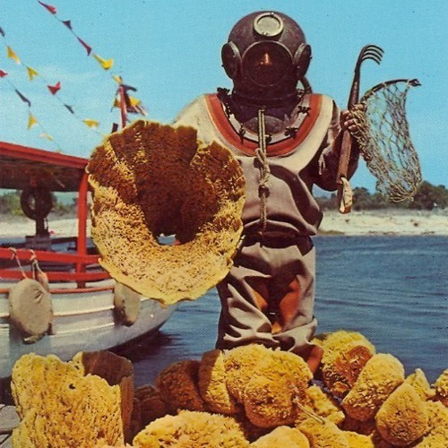

<AudioPlayer source={'https://traffic.libsyn.com/reverberationradio/Reverberation_110.mp3'} />

<strong>Reverberation #110 </strong><strong><a href="https://traffic.libsyn.com/reverberationradio/Reverberation_110.mp3" title="download" target="_blank">download </a></strong>1. Agincourt - Mirabella 2. Paco De Lucia - Entre Dos Aguas 3. Los 007 - Yo La Quiero M&aacute;s 4. Mac DeMarco - Goodbye Weekend 5. Fran&ccedil;oise Hardy - J'ai Jet&eacute; Mon Coeur (I Threw Away My Heart) 6. Lazy Smoke - Wait Till You See (demo) 7. Nelson &Acirc;ngelo E Joyce - Sete Cachorros 8. Gene Lawerence - In The Dew And The Rain 9. Jonathan Richman - When I Dance 10. Sunshine Company - Four In The Morning 11. Neil Young - Harvest Moon

