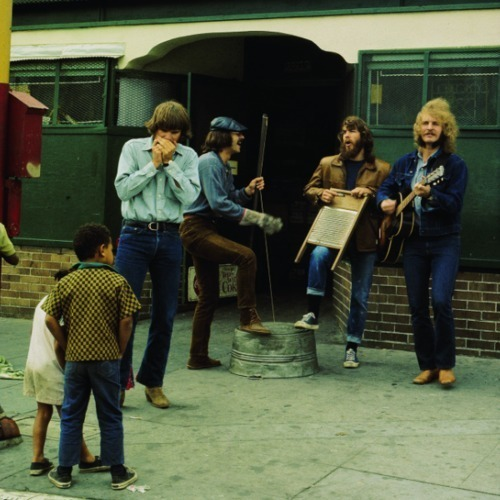

<AudioPlayer source={'https://traffic.libsyn.com/reverberationradio/Reverberation_113.mp3'} />

<strong>Reverberation #113 </strong><strong><a href="https://traffic.libsyn.com/reverberationradio/Reverberation_113.mp3">download </a></strong>1. Creedence Clearwater Revival - Lodi 2. Tebot Piws - Nwy Yn Y Nen 3. Link Wray - Southern Lady 4. Val Stoecklein - Possibility I Was Wrong 5. Ron Davies - Lover and the Loved 6. Michel Polnareff - La Poup&eacute;e Qui Fait Non 7. Roger McGuinn - Painted Lady 8. Alan Hull - If I'm Hungry 9. Grinderman - Palaces of Montezuma

