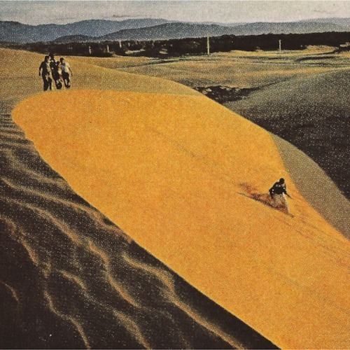

<AudioPlayer source={'https://traffic.libsyn.com/reverberationradio/Reverberation_119.mp3'} />

<strong>Reverberation #119 </strong><strong><a href="https://traffic.libsyn.com/reverberationradio/Reverberation_119.mp3">download </a></strong>1. Afro Blues Quintet Plus 1 - La La La La La 2. Kevin Ayers - The Oyster and The Flying Fish 3. Jacques Dutronc - Hippie Hippie Hourrah 4. The Pretty Things - You Might Even Say 5. Nese Karab&ouml;cek - Atsan Atilmaz Satsan Satilmaz 6. Hugh Masekela - Umaningi Bona 7. Twinkeyz - Aliens In Our Midst 8. Bruce Springsteen - Nebraska 9. Ted Lucas - It's So Easy When You Know What You're Doing

