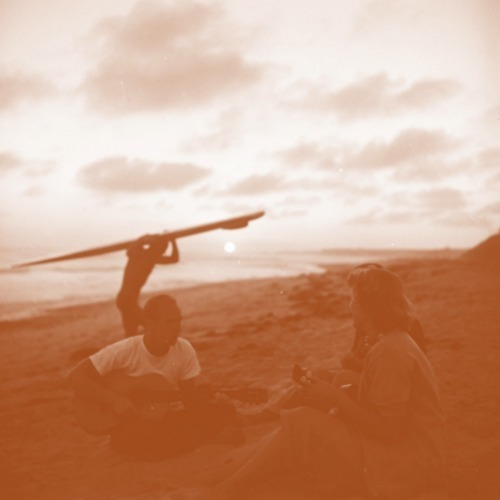

<AudioPlayer source={'https://traffic.libsyn.com/reverberationradio/Reverberation_120.mp3'} />

<strong>Reverberation #120 </strong><strong><a href="https://traffic.libsyn.com/reverberationradio/Reverberation_120.mp3" title="download" target="_blank">download </a></strong>1. Eden Ahbez - Eden's Island 2. Lazy Smoke - There Was A Time 3. Jacco Gardner - Always On My Mind 4. The Aggregation - Looking For The Tour Guide 5. McDonald &amp; Giles - Flight Of The Ibis 6. Felt - I Worship The Sun 7. The Golliwogs - You Came Walking 8. Wimple Winch - Marmalade Hair 9. Blue Things - Silver And Gold 10. Caetano Veloso &amp; Gal Costa - Onde Eu Nasci Passa Um Rio 11. Friends - Take A Walk 12. Alice Coltrane - Govinda Jai Jai

