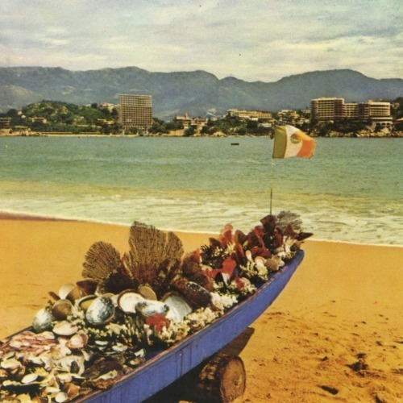

<AudioPlayer source={'https://traffic.libsyn.com/reverberationradio/Reverberation_122.mp3'} />

<strong>Reverberation #122 </strong><strong><a href="https://traffic.libsyn.com/reverberationradio/Reverberation_122.mp3">download </a></strong>1. Salom&eacute; - Esperar&eacute; 2. Rene y Rene - He Sabido Que Te Amaba 3. Ritmo 7 - Al Final 4. Jos&eacute; Mar&iacute;a Napol&eacute;on - La Vida 5. Los Baby&rsquo;s - Sabotaje 6. Los Angeles Negros - Esta Noche La Paso Contigo 7. Grupo Alpha - Gorrioncillo 8. Silvana Di Lorenzo - Me Muero Por Estar Contigo 9. King Clave - Los Hombres No Deben Llorar 10. Jeanette - Un D&iacute;a Es Un D&iacute;a 11. Los Baby&rsquo;s - Triangulo 12. Juan Torres - Historia De Amor

