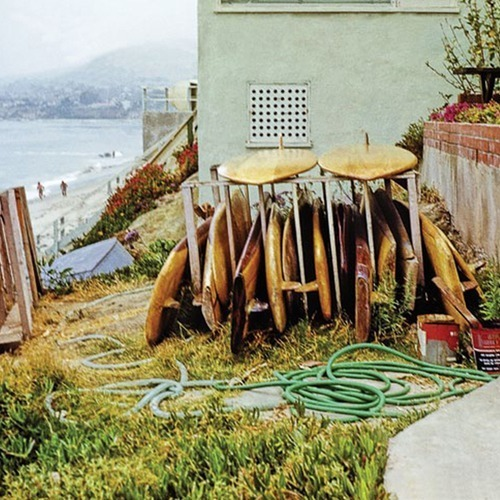

<AudioPlayer source={'http://traffic.libsyn.com/reverberationradio/Reverberation_124.mp3'} />

<strong>Reverberation #124 </strong><strong><a href="http://traffic.libsyn.com/reverberationradio/Reverberation_124.mp3">download </a></strong>1. Morgus &amp; The Daringers - The Morgus Creep 2. Jimmy Campbell - Green Eyed American Actress 3. JJ Cale - In Our Time 4. News - Misty Day (demo) 5. Dane Sturgeon - Wild N' Tender 6. Robert Hinchliffe - Words Upon An Ocean 7. Curtiss Maldoon - Fly Like Eagle 8. Attention Span - That's How I Wanted It To Be

