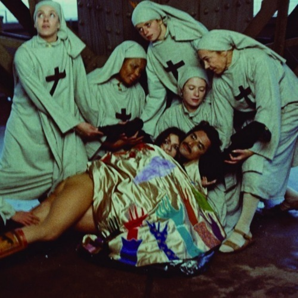

<AudioPlayer source={'http://traffic.libsyn.com/reverberationradio/Reverberation_125.mp3'} />

<strong>Reverberation #125 </strong><strong><a href="http://traffic.libsyn.com/reverberationradio/Reverberation_125.mp3" title="download" target="_blank">download </a></strong>1. Merrell Fankhauser and H.M.S. Bounty - Madame Silky 2. The Mummies - The Thing From Venus 3. The Creation - Through My Eyes 4. Kim Jung Mi - Ganadaramabasa 5. Nucleus - Taranaki 6. Clientele - Joseph Cornell 7. Oh No - What We Got 8. Peep Show - Mazy 9. Lee Hazlewood - For One Moment 10. The Kings Verses - She Belonged To Me

