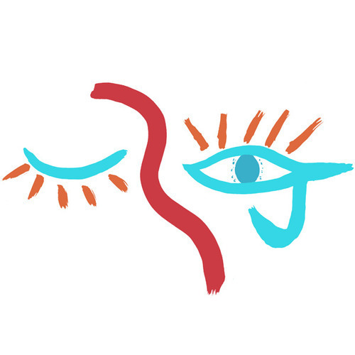

<AudioPlayer source={'http://traffic.libsyn.com/reverberationradio/Reverberation_126.mp3'} />

<strong>Reverberation #126</strong> <strong><a href="http://traffic.libsyn.com/reverberationradio/Reverberation_126.mp3" title="download" target="_blank">download </a></strong>1. The Pets - Hello I Love You 2. Pearls Before Swine - Uncle John 3. Philip Cohran-Artistic Heritage Ensemble - The Minstrel 4. International Harvester - Sommarl&aring;ten 5. Lavender Country - Back In The Closet Again 6. NRBQ - Magnet 7. Ivor Cutler - Mary's A Cow 8. Blank Realm - Back To the Flood 9. Robert Wyatt - Grass 10. The Chills - Night Of Chill Blue (Demo) 11. The New Year - My Bleeding Wound&nbsp;

