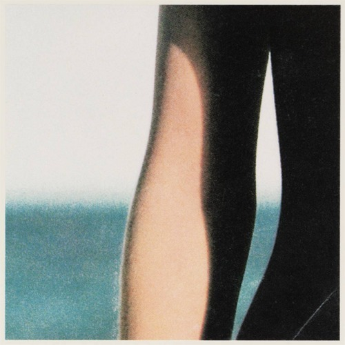

<AudioPlayer source={'https://traffic.libsyn.com/reverberationradio/Reverberation_129.mp3'} />

<strong>Reverberation #129 </strong><strong><a href="https://traffic.libsyn.com/reverberationradio/Reverberation_129.mp3" title="download" target="_blank">download </a></strong>1. Mitch Ryder - One Grain of Sand 2. Ted Daigle &amp; His Westerners - River Boy 3. Too Many People 4. Larry Burda - Night Blast 5. Geri Baird - Backside of the Desert 6. High Society - Star of Eastern Street 7. La Sonora Dinamita - Ritmo de Tambo 8. Wendell Stuart and the Downbeaters - My World Is Empty 9. Redbone - Wovoka 10. Del Shannon - Over You

