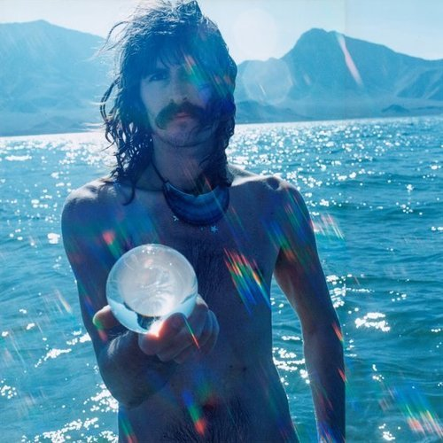

<AudioPlayer source={'https://traffic.libsyn.com/reverberationradio/Reverberation_131.mp3'} />

<strong>Reverberation #131 </strong><strong><a href="https://traffic.libsyn.com/reverberationradio/Reverberation_131.mp3" title="download" target="_blank">download </a></strong>1. The Troggs - I Just Sing 2. Harpers Bizarre - Knock On Wood 3. Margo Guryan - Sun 4. Lazy Smoke - Sarah Sunday 5. Pink Floyd - Crumbling Land 6. Trap Door - &#64258;&Dagger; 7. Public Nuisance - Sabor Thing 8. Moby Grape - 8:05 9. Los &Aacute;tomos De Paramonga - El Trencito 10. Spectrum - Take Your Time

